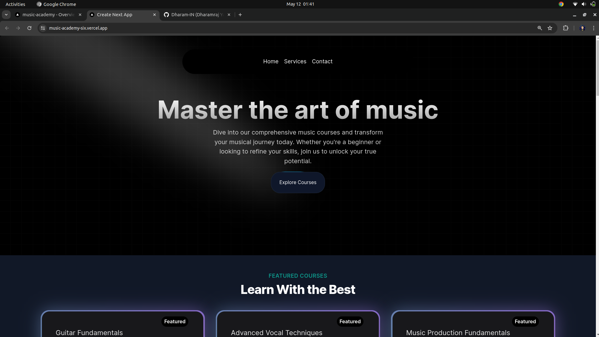

# Music School Website

## Description
This project is a Music School website, dedicated to providing premier musical education. It is built using Next.js, TypeScript, Tailwind CSS, and utilizes the Aceternity UI components. This is my first project using Next.js and TypeScript, and I have incorporated improvements in my understanding of these technologies while developing this project.

## Live Demo
- **[View Live](https://music-academy-six.vercel.app/)**

## Features
- **Premier Musical Education:** Offers high-quality musical education services.
- **Next.js and TypeScript:** Utilizes Next.js and TypeScript for improved performance and type safety.
- **Tailwind CSS:** Styling done using Tailwind CSS for rapid development and customizability.
- **Aceternity UI Components:** Integrates Aceternity UI components for a polished user interface.

## Technologies Used
- **Next.js:** Framework for building React applications with server-side rendering and routing.
- **TypeScript:** Adds static typing to JavaScript for improved code quality and maintainability.
- **Tailwind CSS:** Utility-first CSS framework for creating custom designs without writing CSS.
- **Aceternity UI:** UI components library for building modern web applications.

## Screenshot

## Usage
1. Explore the website to learn about the music school's offerings and services.
2. Navigate through different sections such as courses, instructors, and events.
3. Use the contact form to get in touch with the music school for inquiries or registration.

## How to Run
1. Clone this repository to your local machine.
2. Install dependencies using `npm install`.
3. Run the development server using `npm run dev`.

## Credits
- UI components provided by [Aceternity UI](https://ui.aceternity.com/).

## Author
[Dharam]

Feel free to customize this readme file according to your project's specifics and preferences.
